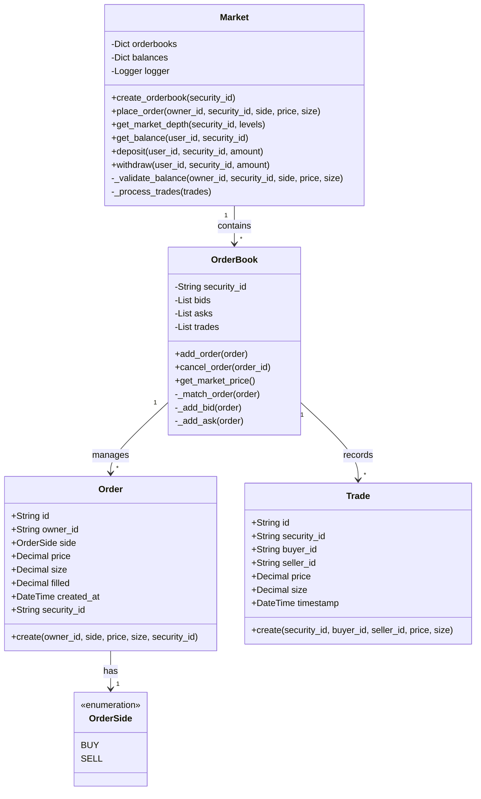
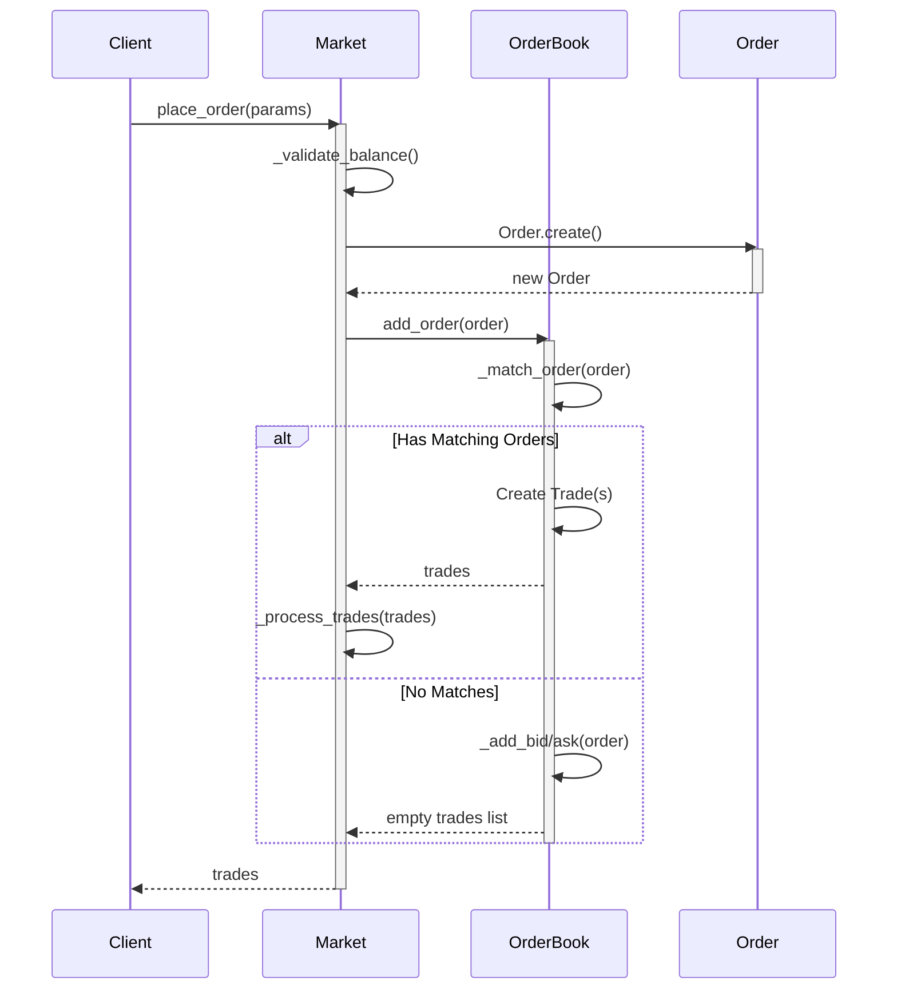
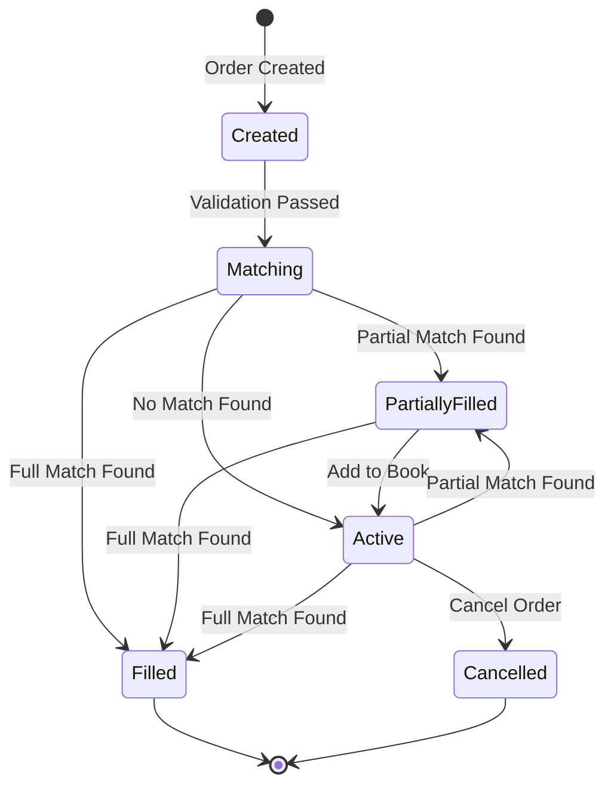

# Exchange System Design Document

## 1. System Overview

The Exchange System is a Python-based implementation of a security trading platform that supports order matching, balance management, and trade settlement. The system implements a price-time priority matching algorithm and maintains separate orderbooks for different securities.

## 2. Core Components

### 2.1 Market
The Market class serves as the main entry point and coordinator for the exchange system. It:
- Manages multiple orderbooks for different securities
- Tracks user balances
- Validates orders
- Processes trades
- Handles deposits and withdrawals

### 2.2 OrderBook
The OrderBook class manages the order matching and trade execution for a single security. It:
- Maintains separate lists for buy (bid) and sell (ask) orders
- Implements price-time priority matching
- Records executed trades
- Provides market depth information

### 2.3 Order
The Order class represents a single order in the system with properties:
- Unique identifier
- Owner information
- Side (buy/sell)
- Price and size
- Fill amount
- Creation timestamp

### 2.4 Trade
The Trade class represents an executed trade with properties:
- Unique identifier
- Security identifier
- Buyer and seller information
- Price and size
- Execution timestamp

## 3. Key Processes

### 3.1 Order Placement Process
1. Client submits order to Market
2. Market validates user balance
3. Market creates Order object
4. Order is submitted to appropriate OrderBook
5. OrderBook attempts to match order
6. If matches found, trades are created and processed
7. If unmatched quantity remains, order is added to book

### 3.2 Order Matching Algorithm
1. For buy orders:
   - Match against asks in ascending price order
   - Match if ask price ≤ buy price
2. For sell orders:
   - Match against bids in descending price order
   - Match if bid price ≥ sell price
3. Within same price level, orders are matched in time priority

### 3.3 Trade Settlement Process
1. Trade is created with matched quantity
2. Buyer's cash balance is decreased
3. Seller's cash balance is increased
4. Buyer receives securities
5. Seller's security balance is decreased
6. Order fill amounts are updated
7. Fully filled orders are removed from book

## 4. State Management

### 4.1 Order States
- Created: Initial state after order creation
- Matching: Order is being matched against the book
- Active: Order is in the book awaiting matches
- PartiallyFilled: Order has some fills but remains active
- Filled: Order is completely filled
- Cancelled: Order was cancelled by user

### 4.2 Balance Management
- Balances are tracked per user and security
- Cash balances are tracked with 'cash' as security_id
- Balance validation occurs before order placement
- Balances are updated atomically during trade settlement

## 5. Data Structures

### 5.1 Orderbook Storage
- Bids: List sorted by price (descending) and time
- Asks: List sorted by price (ascending) and time
- Trades: List of executed trades

### 5.2 Balance Storage
- Two-level dictionary: user_id -> security_id -> amount
- Decimal type used for precise calculations

## 6. Error Handling

### 6.1 Validation Checks
- Security existence
- Sufficient balance
- Valid order parameters
- Order ownership for cancellations

### 6.2 Error Conditions
- Invalid security identifier
- Insufficient balance
- Invalid order parameters
- Unauthorized cancellation
- Order not found

## 7. Future Enhancements

### 7.1 Potential Improvements
- Persistent storage for orders and trades
- Support for different order types (market, limit, stop)
- Fee calculation and collection
- Advanced matching algorithms
- Real-time market data distribution
- Risk management systems

### 7.2 Performance Optimizations
- Index structures for order lookup
- Optimized data structures for order matching
- Caching of market depth calculations
- Batch processing of trades
- Parallel order matching

## 8. Diagrams

The system is documented with three types of UML diagrams:

1. Class Diagram: Shows the static structure and relationships between classes
2. Sequence Diagram: Illustrates the order placement and matching process
3. State Diagram: Depicts the lifecycle of an order in the system

These diagrams provide different views of the system's architecture and behavior.

